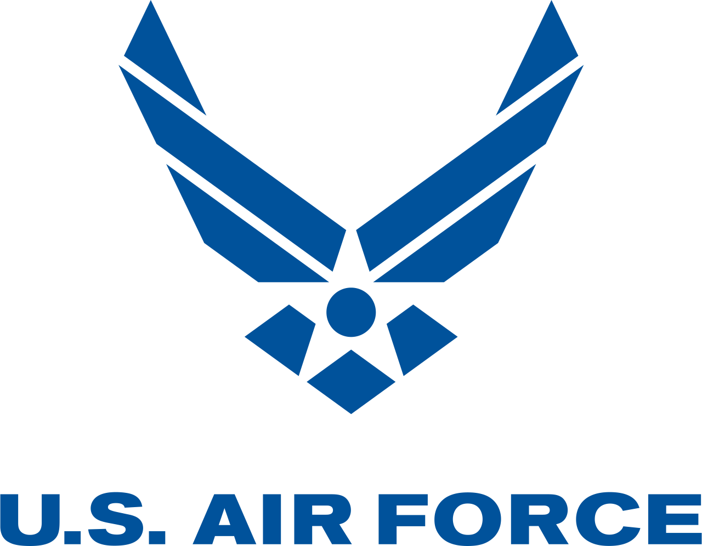

> *For a more compact version, [download my resume](/assets/files/NoahWrightResume.pdf).*

## Work History
###  Google
March 2022 - March 2023
{: .text-right}

> - Maintained TypeScript and closure template front ends, applying accessibility best practices.
> - Implemented secure proxy for gRPC calls. Wrote Java code for backend microservices.
> - Led documentation and code health effort. Improved onboarding/on-call docs and fixed flaky tests.

###  689th Network Operations Squadron, USAF Reserves
March 2020 - May 2022
{: .text-right}

> - Taught Windows terminal, Python scripting, and public speaking fundamentals to unit’s cybersecurity Airmen.
> - Trained unit on using Splunk to investigate threats. Created script to automate creation of queries.
> - Mentored three direct reports. Wrote performance reviews, and reported issues to leadership.

###  Sovereign Sportsman Solutions
May 2021 - March 2022
{: .text-right}

> - Built .NET MVC sites for state governments. Utilized Entity Framework, Kendo UI, Vue, MS SQL Server
> - Led full-stack development for new feature. Gathered requirements, designed DB schema, wrote CRUD pages

###  CGI
March 2020 - May 2021
{: .text-right}

> - Led effort to improve code health. Used SonarQube to identify and correct 250+ tech debt issues. Mentored junior engineers on best practices.
> - Maintained internal .NET microservices. Demoed features, reviewed code for scrum team, and managed Jenkins build pipelines.
> - Refactored legacy service to implement DI & automated testing. Increased code coverage from 0% to 70% in one sprint.

###  Airman Leadership School, USAF
March 2016 - February 2020
{: .text-right}

> - Wrote JavaScript/Visual Basic scripts to automate administrative duties. Increased class size 30% without adding staff.
> - Integrated PayPal checkout, enabling 2K reservations worth over $52K. Drove paperless effort, eliminating 90% of printed material.
> - Pioneered new curriculum and learning management system. Instructed hundreds of Airmen in military leadership.

###  Air University HQ, USAF
December 2011 - February 2016
{: .text-right}

> - Led code security clean-up effort. Fixed 262 vulnerabilities, including SQL injection/remote execution risk.
> - Rewrote legacy code to be multithreaded. Sped one process by 99%, reducing runtime from 2 hours to 1 minute.
> - Upgraded legacy ASP.NET web app from deprecated API. Resolved dozens of dependency issues, prevented outage.

###  Basic Training &amp; Tech School, USAF
May 2011 - December 2011
{: .text-right}

### Art Clem Enterprises
July 2008 - May 2011
{: .text-right}

> - Integrated with UPS/USPS API's to automate carrier selection. Saved $30K per year in labor and shipping.
> - Designed bespoke inventory tracking and item verification solution. Prevented item shortages and misshipments.
> - Hand-built order tracking chron job. Sent automated emails to notify customers of package delivery.
> - Wrote web scrapers to gather product and vendor information, guaranteeing accurate pricing and inventory.

---

## Education &amp; Training
### College / University
#### Trident Univeristy International
<!--
- Master of Science, IT Management, Cybersecurity Concentration (*in progress*)
-->
- Bachelor of Science, Computer Science (grad 2019)
  - Graduated summa cum laude, 3.97 GPA

#### Community College of the Air Force
- Associate of Applied Science, Instructor of Technology and Military Science (2017)
- Associate of Applied Science, Computer Science Technology (2015)

### Military / Leadership Training
- Noncommissioned Officer Academy (October 2021)
- Senior Enlisted Joint Professional Military Education I (September 2021)
- Enlisted Professional Military Education Instructor Course (March 2016)
  - Graduated on the Dean's List due to high academic performance
  - Entered the course before reaching the rank of Staff Sergeant, something the staff had never seen before
- Airman Leadership School (July 2015)
